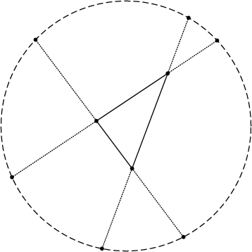

# ConwayCircles

## Conway's Circle Theorem

Given noncollinear points $A$, $B$, and $C$, form the triangle $ABC$. 

Let $a$ be the length of the side opposite vertex $A$. Extend the segments $AB$ and $AC$ away from the triangle; the two extensions have length $a$.

Repeat this at $B$ and at $C$. 

The six points at the ends of these line segments lie on a common circle!

See [https://en.wikipedia.org/wiki/Conway_circle_theorem](https://en.wikipedia.org/wiki/Conway_circle_theorem)

## Create the drawing

Specify the vertices of the triangle as complex numbers, `A`, `B`, and `C`. Then use `ConwayCircle(A,B,C)` to draw the diagram. 

```
julia> using ConwayCircles

julia> (A, B, C) = (2 + 3im, 5 - 1im, 8 + 7im);

julia> ConwayCircle(A,B,C)
```


